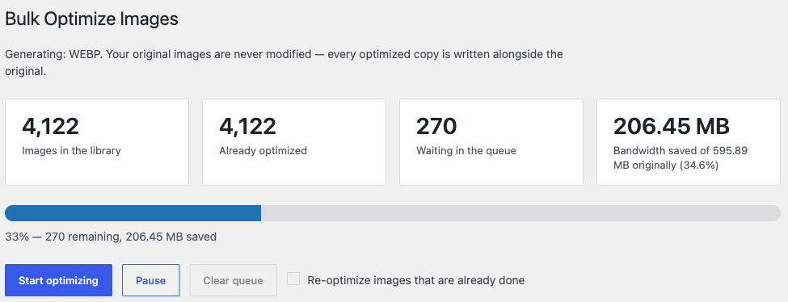
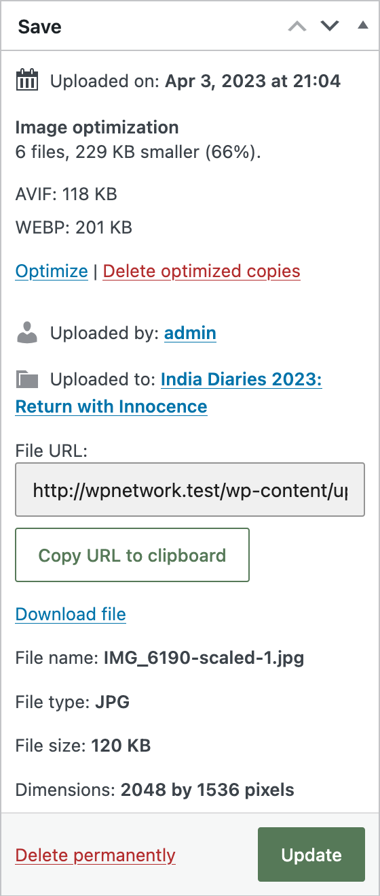

# WebberZone Image Optimizer

Convert your WordPress media library to WebP and AVIF, and serve the best format each browser supports. Free and open source, GPL-2.0-or-later, no external service.

## Screenshots



*Bulk Optimize works through a resumable queue — close the tab and it carries on.*



*Every attachment shows what each format saved, with Optimize and Delete actions.*

## What it does

- Converts JPEG, PNG and GIF sources to WebP and/or AVIF **sidecar** files: `photo.jpg` → `photo.jpg.webp`. The original is never modified.
- Serves them with a `<picture>` element so the *browser* picks the format — which is what keeps it correct behind page caches and CDNs.
- Maps every `srcset` candidate, preserving width descriptors exactly, and falls back to the original if any candidate is missing.
- Bulk-converts an existing library through a resumable, database-backed queue.

## Requirements

WordPress 6.6+, PHP 7.4+, and an image extension you already have — WordPress cannot resize an upload without **Imagick** or **GD**, so every working install has one.

| Format | Needs |
| --- | --- |
| WebP | GD (PHP 5.5+) or Imagick. Effectively universal. |
| AVIF | PHP 8.1+ with GD built against libavif, **or** Imagick with an AVIF delegate. Common, but not guaranteed. |

`Capabilities` does not trust `Imagick::queryFormats()` or `function_exists()` alone — a registered delegate is not the same as a working encoder. Each driver/format pair is verified by encoding a bundled 64×64 PNG, and the result is cached in the `wzio_capabilities` option keyed on plugin version.

Nothing leaves the server. There are no `wp_remote_*` calls, no `curl`, no external fonts or CDN assets in the admin screens — every dependency is bundled.

## Why the extension is appended, not replaced

`photo.jpg.webp` rather than `photo.webp`. If two source files share a stem — `logo.jpg` and `logo.png` in one folder — replacing the extension collides on a single sidecar, and the delivery layer can no longer tell which original a sidecar belongs to.

## Why `<picture>` rather than an `Accept` rewrite

An `Accept`-header rewrite returns different bytes for the same URL. A cache in front of it that ignores `Vary` serves one visitor's format to everyone. `<picture>` moves the choice into the browser: identical HTML for every visitor, no cache interaction at all.

The `Accept` rewrite is still the right tool for CSS background images, which never appear in markup the plugin can rewrite. The Delivery settings tab generates those rules — with `Vary: Accept` — for the administrator to install.

## Architecture

| Class | File | Purpose |
|---|---|---|
| `Main` | `includes/class-main.php` | Singleton bootstrap |
| `Capabilities` | `includes/class-capabilities.php` | Probes each driver/format pair by encoding a bundled test image; caches the result |
| `Converter` | `includes/class-converter.php` | Per-attachment and per-file conversion, skip rules, orphan cleanup |
| `Attachment_Meta` | `includes/class-attachment-meta.php` | Per-file conversion records in `_wzio_data` post meta |
| `Attachment_Hooks` | `includes/class-attachment-hooks.php` | Upload, edit, regenerate and delete integration |
| `Database` | `includes/class-database.php` | Per-site queue table, multisite-aware install |
| `Queue` | `includes/class-queue.php` | Queue row operations, claims, retries, stale release |
| `Scanner` | `includes/class-scanner.php` | Direct-SQL enumeration of convertible attachments |
| `Processor` | `includes/class-processor.php` | Batch runner shared by the bulk screen, cron and CLI |
| `Drivers\Imagick_Driver` | `includes/drivers/` | Preferred backend: AVIF, animation, encoder tuning |
| `Drivers\GD_Driver` | `includes/drivers/` | Fallback backend |
| `Frontend\Rewriter` | `includes/frontend/class-rewriter.php` | `<picture>` output, srcset mapping, lazy queueing |
| `Frontend\Resolver` | `includes/frontend/class-resolver.php` | URL → sidecar lookup with request and object cache layers |
| `Frontend\Server_Rules` | `includes/frontend/class-server-rules.php` | Apache and nginx rule generation |
| `Admin\Bulk_Page` | `includes/admin/class-bulk-page.php` | Bulk screen and its AJAX endpoints |
| `Admin\Media_Library` | `includes/admin/class-media-library.php` | Media list column and row actions |
| `CLI\CLI` | `includes/cli/class-cli.php` | `wp wzio` commands |

Namespace `WebberZone\Image_Optimizer`, prefix `wzio`, constants `WZIO_*`, settings key `wzio_settings`.

## WP-CLI

```bash
wp wzio status                        # what this server can encode, and progress
wp wzio convert <id>... [--force]     # convert now
wp wzio queue [--force]               # fill the background queue
wp wzio run [--batch=<n>]             # work through the queue
wp wzio clean [<id>...]               # delete generated files
```

## Development

```bash
composer install
composer test             # phpcs + phpcompat + phpstan
composer phpcbf           # auto-fix code style
composer zip              # build the distribution zip
pnpm install && pnpm run build:assets   # minify CSS/JS, generate RTL
```

Unit tests need the WordPress test suite:

```bash
bash phpunit/install.sh wzio_tests root '' 127.0.0.1 latest
vendor/bin/phpunit
```

34 tests cover path and URL mapping, traversal guards, `srcset` parsing, `<picture>` construction and its bail-out rules, buffered rewriting, and a real end-to-end conversion including the reuse, staleness, discard-if-larger and exclusion paths.

## Notable filters

- `wzio_conversion_args` — quality, formats, effort, thresholds
- `wzio_attachment_files` — which files an attachment converts
- `wzio_is_excluded` — per-file exclusion
- `wzio_delivery_enabled` — disable rewriting for a request
- `wzio_driver_classes` — register a custom encoder backend
- `wzio_memory_multiplier` — tune the memory guard
- `wzio_attachment_converted` — action fired after each attachment
